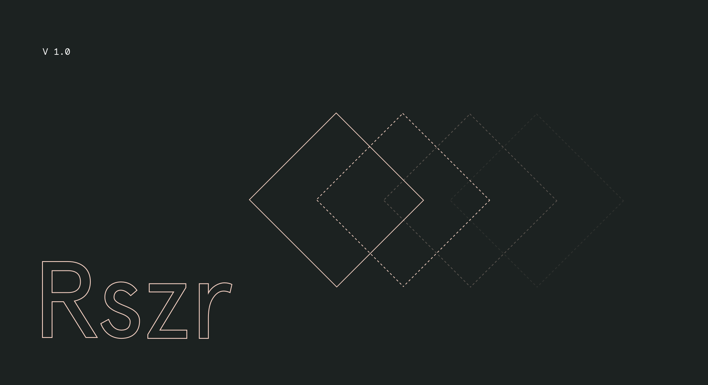

# Rszr
### A Sketch plugin that enables quick key commands to resize symbols to their original dimensions.

Sometimes updating a Sketch library causes symbols with updated dimensions to become skewed. Rszr gives you access to select symbols and quickly resize them to their original dimension using key commands. Rszr also lets you resize a symbol and realign it to its parent group.

## Usage
1. Download the zip and open Rszr.sketchplugin
2. Select the symbol you want to resize
3. Use **cntrl o** to resize the symbol to its original dimensions, or **cntrl cmd o** to resize the symbol to its original dimensions and reposition it to its parent group.  
4. You can also access these actions in Plugins > Rszr

## Download
[Rszr.sketchplugin.zip](https://github.com/jordan-sowers/Rszr/raw/master/Rszr.sketchplugin.zip)
